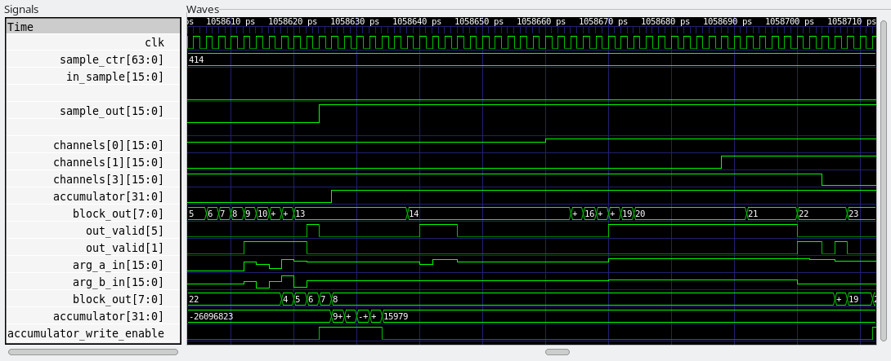

*<p style="text-align: center;">(Pictured: GTKWave screenshot of Verilator simulation computing biquadratic filters)</p>*

# M-FPGA

Hardware DSP engine for M: The Everything Pedal.

Implements a fixed-point, pipelined, programmable audio processing core targeting Gowin GW2AR devices.

## Features

- Single cycle throughput for MAC instructions
- A/B pipelines with smoothed crossover and warmup
- Out-of-order execution with scoreboard hazard prevention
- Order enforced at commit boundary
- Delay buffer controller 
- Arbitrary IIR filter engine
- Variable fixed-point format controlled by instruction field
- Simple instruction set
- Timing closure at 112.5MHz on GW2AR-18 (logic depth 10)

## Architecture

The overall architecture of M-FPGA is shown below. The engine receives audio over I2S, processes it, and transmits it via I2S. It is intended for use with a microcontroller running the corresponding software [M-interface](https://github.com/linkin-parks-bassist/m-interface) and connected to the FPGA via SPI.

<p align="center">
  
</p>

In order to take full advantage of the limited logic and abundant time resources available on the Gowin GW2AR-18 FPGA, it was decided to use a CPU-like architecture, where DSP blocks are realised as instructions stored sequentially in a core-local BSRAM. The blocks are executed, in order, once per sample.

There are two DSP cores, which execute DSP pipelines programmed via SPI commands. Programming commands write instructions into the back core, and, after a brief warmup period, the outputs of the cores are smoothly crossfaded, so as the DSP can be reconfigured at runtime without harsh artifacts.

The base word-width of the engine is parametrised, with default value 16, to accommodate the maximum multiplication width of 18x18 in the GW2AR-18 DSPs. Future versions plan to target FPGAs with wider multipliers, to improve DSP precision.

### Core Microarchitecture

<p align="center">
  
</p>

Each core possesses a set of 16 *channels*. These behave similarly to the registers in a typical load-store architecture, but are not preserved between samples. When a new sample becomes available over I2S, the value in channel 0 is sampled, and sent to the mixer, and channel 0 is overwritten with the new input sample, after which, the programmed sequence of blocks is run.

In addition to the channels, each block has a pair of *block registers*. Block registers are immutable, being written only via SPI commands. They can appear as the arguments for any instruction.

Finally, there is a wide accumulator - 40 bits when `data_width = 16`, which is subject to dedicated multiply-accumulate instructions `macz`, `mac`, their unsigned equivalents, `umacz` and `umac`, and `mov_acc`, which moves the (saturated, shifted) value of the accumulator to a channel.

The execution pathway is a branched pipeline. Blocks are fed in-order from BSRAMs and decoded. In the operand fetch stage, a scoreboard is maintained, which keeps track of how many in-flight instructions plan to write to each channel, and to the accumulator. If any of the operands of the given instruction have pending writes, the operand fetch stage stalls until the final pending write is issued. Following this, instructions are routed to a number is independent branches. This introduces the risk that instructions with side-effects may complete out-of-order. To ensure coherence, each instruction with side effects is issued with a commit ID, and the final stage in the pipeline, the *commit master*, accepts and executes writes strictly in-order of the issued IDs.

With the inclusion of skid buffers to break long combinatorial chains and create elasticity, the pipeline achieves single-cycle throughput in the absence of operand fetch stalls. At 112.5MHz, with sample rate 44.1kHz, this gives a theoretical max of 2551 operations per sample. Future plans include pipelining multiple cores together, slightly increasing latency but multiplying computational capacity.

Since any given branch is strictly in-order, by restricting write permissions to the accumulator strictly to the MAC branch, it is safe to ignore pending writes to the accumulator for MAC-type instructions. As a result, single-cycle throughput is the typical case for successive MAC operations.

### "Resource" Units

The so-called "resource branches" are the distinct branches which exist solely to dispatch reads and writes to/from the

- Lookup tables,
- Memory,
- Delay buffers,
- Filters.

#### Lookup tables

The lookup-tables are used to compute non-trivial mathematical functions on-device. There are future plans to make available programmable lookup-tables, programmed via SPI, but currently there are only two: one which computes `sin(2πx)`, for use with tone generation or LFOs, and one which computes `tanh(4x)`, intended for distortion. More to follow.

#### Memory

This makes available a kilobyte or so of SRAM, which can be used to store and retrieve values needed to persist between samples. This is useful for, e.g., envelope trackers, or other filters.

#### Delay buffers

There is a dedicated delay buffer controller, with a fixed number of slots, which manages allocation, addressing, reading and writing to delay buffers. Delay buffers are allocated via a dedicated SPI command. The intention is that these will be allocated in the 8MB SDRAM integrated in the GW2AR-18, but, at the time of writing, the SDRAM controller has not been connected, and the delay buffer controller allocates in a small BSRAM, with a maximum total delay of 370ms at 16b, 44.1kHz. Delay buffers acquire handles according to the order of allocation.

There are exactly two block instructions to access delay buffers, on the hardware level. `delay_read` simply fetches a cached value. `delay_mwrite` takes three arguments; one is a sample to write, one is the *modulation argument*, and the third is a handle. The assembler recognises a third instruction, `delay_write`, which is simply the special case where the modulation argument is 0. This instruction writes the given sample to the buffer, advances its position, and adds the modulation coefficient, considered in q8.8, to the stored delay offset. Following a write, the delay buffer controller automatically fetches and caches the sample to be returned on the next `delay_read`, according to the updated (fractional!) delay offset. The modulation argument allows for modulation of delay, enabling effects such as phasers and flangers, and the prefetch mechanism obviates any concerns with respect to the (variable) latency of SDRAM.

### Filters

M-FPGA includes a general-purpose filter engine. It computes arbitrary filters of the form `y[n] = ∑a[n-k]x[n-k] + ∑b[n-l]y[n-l]` at a rate of one multiplication per sample. It is accessed using the instruction `filter`, which simply takes a sample and a handle. Filters are reserved, and their coefficients written, via SPI.

## Instruction Set

The assembly language, as implemented by [M-interface](https://github.com/linkin-parks-bassist/m-interface) supports inline math expressions, enclosed with `[`, `]` and written into registers by the control MCU. Additionally, one can make direct references to declared resources such as delay buffers or filters, prepended with `$`. Syntax-wise, arguments are separated by spaces, and destination channels always appear as the final argument. Channels are written `cN`, for `N` a decimal number or hex digit between 0 and 15 (inclusive) (0-f, respectively).

| Instruction | Example  		                | Notes                            |
|-------------|---------------------------------|----------------------------------|
| `nop`         | `nop`    			            |                             |
| `add`         | `add c3 c1 c2`                | Implemented as `madd a  1.0 b d`, using the hard-wired "1.0" register `r2` (in q2.14) |
| `sub`         | `sub c1 cD c0`                | Implemented as `madd a -1.0 b d`, using the hard-wired "-1.0" register `r3`            |
| `mul`         | `mul c0 [10^(gain/20)] c0`    | Implemented as `madd a b 0.0  d`, using the hard-wired "0.0" register `r4`            |
| `macz`        | `macz c0 [0.5]`               | Multiply-accumulate with zero; the accumulator is simply overwritten with the product  |
| `mac`         | `mac [(1 - alpha) / (1 + alpha)] c4` | Regular multiply-accumulate    |
| `umacz`       | `umacz c0 [0.5]`                   | Unsigned version of macz|
| `umac`        | `umac c0 c1`                   | Unsigned version of mac  |
| `mov`         | `mov c0 c1`                   | Implemented as `madd a 1.0 0.0 d`    |
| `rsh`         | `rsh c0 3 c1`                 |     |
| `arsh`        | `arsh c1 5 c2`                |     |
| `lsh`         | `lsh c0 3 cB`                 |     |
| `abs`         | `abs c0 c1`                   |     |
| `min`         | `min c0 c1 c2`                |     |
| `max`         | `max c0 c1 c3`                |     |
| `clamp`       | `clamp c0 c1 c2 c3`           |     |
| `sin2pi`      | `sin2pi c5 c6`                | Implemented as `lut_read a $0 d`    |
| `tanh4`       | `tanh4 c0 c0`                 | Implemented as `lut_read a $1 d`    |
| `mem_read`    | `mem_read $x c1`              |     |
| `mem_write`   | `mem_write c4 $y2`            |     |
| `delay_read`  | `delay_read $delay1 c3`       |     |
| `delay_write` | `delay_write c0 $delay1`      |     |
| `delay_mwrite`| `delay_mwrite c0 c4 $delay2`  |     |
| `filter`      | `filter c0 $bq1 c1`           |     |

### Instruction Encoding

Two instruction formats are supports, A and B. Format A accepts up to 3 arguments and has fields relevant for arithmetic, while format B replaces the third operand and arithmetic fields with a `handle` field used in resource access.

Format A:

```
     0      4  5  6    10 11   15 16   20 21  25 26       30 31
    +--------+---+-------+-------+-------+------+----------+---+
    | opcode | f | src A | src B | src C | dest |   shift  | s |
    +--------+---+-------+-------+-------+------+----------+---+
```
Format B:

```
     0      4  5  6    10 11   15 16  19 20                  31
    +--------+---+-------+-------+------+----------------------+
    | opcode | f | src A | src B | dest |        handle        |
    +--------+---+-------+-------+------+----------------------+
```

#### Fields

| Field        | Bits | Description                                                    |
| ------------ | ---- | -------------------------------------------------------------- |
| `opcode`     | 5    | opcode                                                         |
| `f`          | 1    | instruction format (`0` = Format A, `1` = Format B)            |
| `src X`      | 5    | 4-bit channel/register index + 1-bit channel/register selector |
| `dest`       | 4    | destination channel address                                    |
| `shift`      | 5    | shift amount or fixed-point compensation shift                 |
| `s`          | 1    | high-active saturation disable in channel arithmetic if high   |
| `handle`     | 12   | resource handle; LUT/delay/filter ID or memory address         |

## License

GNU GPL 3.0

## Contact

I'd love to hear from you.  
email: davidjfarrell96@gmail.com
