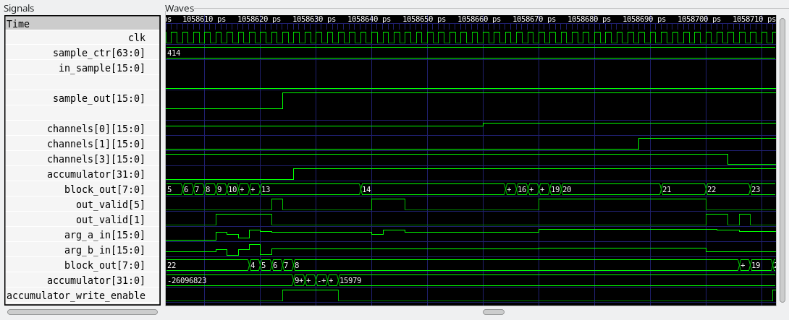
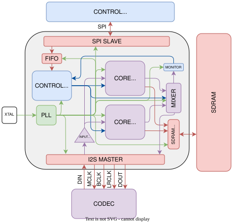
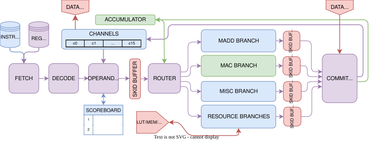

*<p style="text-align: center;">(Pictured: GTKWave screenshot of Verilator simulation computing biquadratic filters)</p>*

# Kestrel Core

Hardware DSP core for Kestrel.

Implements a pipelined fixed-point, programmable audio processing core targeting Gowin GW2AR devices.

## Features

- Single cycle throughput for MAC instructions
- A/B pipelines with smoothed crossover and warmup
- Out-of-order execution with scoreboard hazard prevention
- Order enforced at commit boundary
- Delay buffer controller
- Simple instruction set
- Variable fixed-point format controlled by instruction field
- Polynomial engine and Chamberlin SVF; optional arbitrary IIR filter engine
- Targets 112.5MHz on GW2AR-18; timing qualification follows RTL changes

## RTL tests

Install Verilator and a C++ build toolchain, then run `./run_tests.sh`. Pass module
names to run a subset, for example `./run_tests.sh operand_fetch dsp_core`.

The operand-fetch tests check values, metadata, dependencies, commit IDs,
backpressure and enable pauses. The core tests execute arithmetic programs through
the actual decoder, fetch stages, router, execution branches and ordered commit
across sample boundaries. They print cycles, retirements and fetch-stage busy and
occupancy counts. To write a cycle trace, run
`./verilator/test/dsp_core/run.sh /tmp/core-trace.csv`.

For a before/after comparison, save the old `src/operand_fetch.v` outside the
checkout, then select it with `OPERAND_FETCH_RTL=/absolute/path/operand_fetch.v`
and use a separate `CORE_TEST_BUILD=/tmp/core-baseline` or
`OPERAND_FETCH_BUILD=/tmp/fetch-baseline` directory. Both builds use the same tests.
The fetch-only benchmark uses an eight-cycle writeback sink; the core benchmark
uses the real arithmetic pipeline.

From the Kestrel superproject, run `./tools/test_eff_readback.sh` to compile the
Interface's `readback.eff` fixture with the production compiler and execute its
programming body in the core. This checks `mov`, scratchpad writes, signed
write-snooping readback, live register updates and ordered channel retirement.
`./tools/test_eff_svf.sh` compiles the SVF fixture and connects the core to the
actual filter master. It checks 256 stateful update/read pairs across two private
states, including expression and channel cutoff inputs. The standalone `svf`
Verilator target additionally compares 3,840 samples with an integer recurrence
reference, including cutoff endpoints and different damping formats.
The script also runs `effects/SVFLP.EFF` for 44,100 samples, comparing every output
with the integer reference and checking its 100 Hz / 8 kHz low-pass response.
Pass a WAV filename to retain dry audio on the left and RTL output on the right:
`./tools/test_eff_svf.sh /tmp/svf.wav`.

The superproject's `python3 tools/effect_library.py` extends this to a batch of
compiled arithmetic/SVF/LUT/scratchpad/delay effects, exact comparison with a separate sample model,
parameter corners, response checks and WAV output. Its reusable core mode is
`--render-program PROGRAM.bin INPUT.pcm OUTPUT.pcm`, using mono signed PCM16.
Only the final instruction may write c0; delay and static polynomial allocation/
coefficient writes are supported. Live coefficient updates and other resource
programming are rejected. The actual delay unit uses a delayed RAM
transaction responder, with per-buffer address checks and nonzero initial words.
`python3 tools/test_eff_delay.py` in the superproject verifies taps, startup fade,
feedback and buffer isolation, including minimum-one taps for zero/negative final
offsets. SDRAM hardware is not modeled. `python3 tools/test_eff_poly.py` verifies
compiler-programmed quadratic/constant resources over all signed16 inputs.
The renderer performs full reset before programming and uses the actual LUT
master and 256-word scratchpad. Run it from this repository so `luts/` resolves.
The superproject's `python3 tools/test_eff_state.py` checks all input words for
each built-in LUT and a persistent-state/read-after-write recurrence.
The library guide documents the supported subset and USB deployment.

These harnesses receive programming commands at the core's control strobes. They
do not exercise SPI framing, the enclosing controller/mixer, the other resource
engines or physical audio. Full one-pipeline effect verification remains pending.

## Architecture

The overall architecture of Kestrel Core is shown below. The engine receives audio over I2S, processes it, and transmits it via I2S. It is intended for use with a microcontroller running the corresponding software [Kestrel Interface](https://github.com/linkin-parks-bassist/kestrel-interface) and connected to the FPGA via SPI.

<p align="center">
  
</p>

In order to take full advantage of the limited logic and abundant time resources available on the Gowin GW2AR-18 FPGA, it was decided to use a CPU-like architecture, where DSP blocks are realised as instructions stored sequentially in a core-local BSRAM. The blocks are executed, in order, once per sample.

There are two DSP cores, which execute DSP pipelines programmed via SPI commands. Programming commands write instructions into the back core, and, after a brief warmup period, the outputs of the cores are smoothly crossfaded, so that the DSP can be reconfigured at runtime without harsh artifacts.

The base word-width of the engine is parametrised, with default value 16, to accommodate the maximum multiplication width of 18x18 in the GW2AR-18 DSPs. Future versions plan to target FPGAs with wider multipliers, to improve DSP precision.

### Core Microarchitecture

<p align="center">
  
</p>

Each core possesses a set of 16 *channels*. These behave similarly to the registers in a typical load-store architecture, but are not preserved between samples. When a new sample becomes available over I2S, the value in channel 0 is sampled, and sent to the mixer, and channel 0 is overwritten with the new input sample, after which the programmed sequence of blocks is run.

In addition to the channels, each block has a pair of *block registers*. Block registers are immutable, being written only via SPI commands. They can appear as the arguments for any instruction.

Finally, there is a wide accumulator - 40 bits when `data_width = 16`, which is subject to dedicated multiply-accumulate instructions `macz`, `mac`, their unsigned equivalents, `umacz` and `umac`, and `mov_acc`, which moves the (saturated, shifted) value of the accumulator to a channel.

The execution pathway is a branched pipeline. Blocks are fed in-order from BSRAMs and decoded. In the operand fetch stage, a scoreboard is maintained, which keeps track of how many in-flight instructions plan to write to each channel, and to the accumulator. If any of the operands of the given instruction have pending writes, the operand fetch stage stalls until the final pending write is issued. Following this, instructions are routed to a number of independent branches. This introduces the risk that instructions with side-effects may complete out-of-order. To ensure coherence, each instruction with side effects is issued with a commit ID, and the final stage in the pipeline, the *commit master*, accepts and executes writes strictly in-order of the issued IDs.

With the inclusion of skid buffers to break long combinatorial chains and create elasticity, the pipeline achieves single-cycle throughput in the absence of operand fetch stalls. At 112.5MHz, with sample rate 44.1kHz, this gives a theoretical max of 2551 operations per sample. Future plans include pipelining multiple cores together, slightly increasing latency but multiplying computational capacity.

Since any given branch is strictly in-order, by restricting write permissions to the accumulator strictly to the MAC branch, it is safe to ignore pending writes to the accumulator for MAC-type instructions. As a result, single-cycle throughput is the typical case for successive MAC operations.

### "Resource" Units

The so-called "resource branches" are the distinct branches which exist solely to dispatch reads and writes to/from the

- Lookup tables,
- Memory,
- Delay buffers,
- Filters.

#### Lookup tables

The lookup-tables are used to compute non-trivial mathematical functions on-device. There are future plans to make available programmable lookup-tables, programmed via SPI, but currently there are only two: one which computes `sin(2πx)`, for use with tone generation or LFOs, and one which computes `tanh(4x)`, intended for distortion. More to follow.

#### Memory

This makes available a kilobyte or so of SRAM, which can be used to store and retrieve values needed to persist between samples. This is useful for, e.g., envelope trackers, or other filters.

#### Delay buffers

The dedicated delay controller allocates buffers sequentially and gives them handles
in allocation order. Each pipeline connects its delay controller to the shared
SDRAM interface, which is wired to the controller at the top level. Actual SDRAM
capacity and physical timing remain to be qualified.

The hardware has read and write opcodes. The assembler exposes
`delay_read $buffer dest`, `delay_mread $buffer a b dest`, and
`delay_write value $buffer`. Modulation belongs to the read: the unit multiplies
A/B after clamping negative A to zero, scales by buffer size, adds the configured base delay and selects one integer
tap. There is no fractional interpolation, cached prefetch or `delay_mwrite`.
Writes advance the circular position. Gain starts at zero until the first complete
buffer traversal, then rises to unity over 256 writes in the 16-bit build.

Final taps clamp to 1..size−1. The write position is the next slot to overwrite,
so offset 1 reads the latest completed write; offset 0 would read the oldest.
Negative A clamps to zero, while signed B may shorten the tap but cannot take it
below one sample. Zero/negative final offsets, fixed/modulated taps,
startup gain, feedback and isolated buffers have compiled model/RTL coverage using
a delayed RAM responder. That does not qualify the SDRAM controller or pins.

### Filters

The default build uses a dedicated polynomial engine and the Chamberlin SVF.
Polynomial coefficients use the existing allocation/write/update/commit commands;
the polynomial engine contains no filter-history memory. SVF retains its private,
once-per-sample state and update/read instruction pairing.

`include/build.vh` controls `ENABLE_FILTER`, `ENABLE_POLYNOMIAL` and `ENABLE_SVF`.
The original general-purpose IIR engine is retained behind `ENABLE_FILTER` and
excluded by default. To select flags entirely on the compiler command line, define
`KESTREL_CUSTOM_BUILD` and the desired `ENABLE_*` macros.

SPI command 40 (`read32`) takes a three-byte address, most significant byte first.
The controller dispatches it outside itself and uses the existing data-ready and
`READOUT` mechanism to return four bytes, most significant byte first. Addresses
are word-aligned: address 0 returns `0x4b455354` ("KEST"); address 4 returns build
flags, with filter/polynomial/SVF in bits 0/1/2. The default is `0x00000006`.
Unmapped addresses have no responder. Narrower reads remain future commands.
Matching firmware adds `fpga-read32 ADDRESS` for diagnosis; automatic instruction
rejection or conversion based on capabilities remains future work.

## Instruction Set

The assembly language, as implemented by [Kestrel Interface](https://github.com/linkin-parks-bassist/kestrel-interface), supports inline math expressions, enclosed with `[`, `]` and written into registers by the control MCU. Additionally, one can make direct references to declared resources such as delay buffers or filters, prepended with `$`. Syntax-wise, arguments are separated by spaces, and destination channels always appear as the final argument. Channels are written `cN`, for `N` a decimal number or hex digit between 0 and 15 (inclusive) (0-f, respectively).

| Instruction | Example                         | Notes |
|-------------|---------------------------------|-------|
| `nop`         | `nop`                         |       |
| `add`         | `add c3 c1 c2`                | Implemented as `madd a  1.0 b d`, using the hard-wired "1.0" register `r2` (in q2.14) |
| `sub`         | `sub c1 cD c0`                | Implemented as `madd a -1.0 b d`, using the hard-wired "-1.0" register `r3` |
| `mul`         | `mul c0 [10^(gain/20)] c0`    | Implemented as `madd a b 0.0 d`, using the hard-wired "0.0" register `r4` |
| `macz`        | `macz c0 [0.5]`               | Multiply-accumulate with zero; the accumulator is simply overwritten with the product |
| `mac`         | `mac [(1 - alpha) / (1 + alpha)] c4` | Regular multiply-accumulate |
| `umacz`       | `umacz c0 [0.5]`              | Unsigned version of macz |
| `umac`        | `umac c0 c1`                  | Unsigned version of mac |
| `mov`         | `mov c0 c1`                   | Implemented as `madd a 1.0 0.0 d` |
| `rsh`         | `rsh c0 3 c1`                 |       |
| `arsh`        | `arsh c1 5 c2`                |       |
| `lsh`         | `lsh c0 3 cB`                 |       |
| `abs`         | `abs c0 c1`                   |       |
| `min`         | `min c0 c1 c2`                |       |
| `max`         | `max c0 c1 c3`                |       |
| `clamp`       | `clamp c0 c1 c2 c3`           |       |
| `sin2pi`      | `sin2pi c5 c6`                | Implemented as `lut_read a $0 d` |
| `tanh4`       | `tanh4 c0 c0`                 | Implemented as `lut_read a $1 d` |
| `mem_read`    | `mem_read $x c1`              |       |
| `mem_write`   | `mem_write c4 $y2`            |       |
| `delay_read`  | `delay_read $delay1 c3`       |       |
| `delay_write` | `delay_write c0 $delay1`      |       |
| `delay_mread` | `delay_mread $delay2 c4 [0.1] c3` | Read-side modulation |
| `filter`      | `filter c0 $bq1 c1`           |       |

## Instruction Encoding

Two instruction formats are supported, A and B. Format A accepts up to 3 arguments and has fields relevant for arithmetic, while format B replaces the third operand and arithmetic fields with a `handle` field used in resource access.

Format A:

```
     0      4  5  6    10 11   15 16   20 21  25 26       30 31
    +--------+---+-------+-------+-------+------+----------+---+
    | opcode | f | src A | src B | src C | dest |   shift  | s |
    +--------+---+-------+-------+-------+------+----------+---+
```

Format B:

```
     0      4  5  6    10 11   15 16  19 20                  31
    +--------+---+-------+-------+------+----------------------+
    | opcode | f | src A | src B | dest |        handle        |
    +--------+---+-------+-------+------+----------------------+
```

#### Fields

| Field        | Bits | Description                                                    |
| ------------ | ---- | -------------------------------------------------------------- |
| `opcode`     | 5    | opcode                                                         |
| `f`          | 1    | instruction format (`0` = Format A, `1` = Format B)            |
| `src X`      | 5    | 4-bit channel/register index + 1-bit channel/register selector |
| `dest`       | 4    | destination channel address                                    |
| `shift`      | 5    | shift amount or fixed-point compensation shift                 |
| `s`          | 1    | high-active saturation disable in channel arithmetic if high   |
| `handle`     | 12   | resource handle; LUT/delay/filter ID or memory address         |

## License

GNU GPL 3.0

## Contact

I'd love to hear from you.  
email: davidjfarrell96@gmail.com
